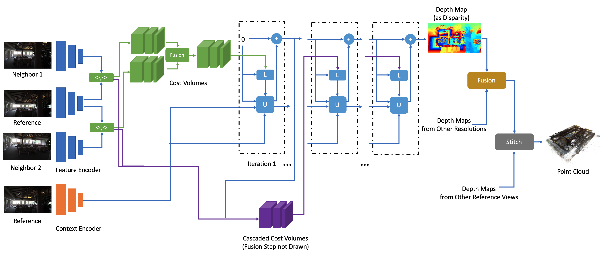

# Multiview Stereo with Cascaded Epipolar RAFT (CER-MVS)

This repository contains the source code for our **ECCV 2022** paper:

**Multiview Stereo with Cascaded Epipolar RAFT**

Zeyu Ma, Zachary Teed and Jia Deng

[arxiv version](https://arxiv.org/abs/2205.04502)

```
@inproceedings{ma2022multiview,
  title={Multiview Stereo with Cascaded Epipolar RAFT},
  author={Ma, Zeyu and Teed, Zachary and Deng, Jia},
  booktitle={Proceedings of the European conference on computer vision (ECCV)},
  year={2022}
}
```




## Requirements


The code has been tested with `PyTorch 1.7` and `Cuda 11.0`.

```
conda env create -f environment.yml
conda activate cer-mvs

# we use gcc9 to compile alt_cuda_corr
export TORCH_CUDA_ARCH_LIST="6.0;6.1;6.2;7.0;7.5;8.0"
cd alt_cuda_corr && python setup.py install && cd ..
```


## Required Data

To evaluate/train CER-MVS, you will need to download the required datasets.

* DTU
    * [Rectified images from the official website](https://roboimagedata.compute.dtu.dk/?page_id=36)
    * Ground truth depths  and cameras[J. Zhang et al.]. [Part1](https://hkustconnect-my.sharepoint.com/:u:/g/personal/jzhangbs_connect_ust_hk/EfZTR-JYiGBJqC873IoQnWgBYCljQBMYv5N7PKQvrCwNbw?e=ThTK8U)
    [Part2](https://hkustconnect-my.sharepoint.com/:u:/g/personal/jzhangbs_connect_ust_hk/ESY13vX9JkBPoAr8sEOfAmgBIQqWoNaEsS0Y10nQqjI-LA?e=uaqZtF)
* BlendedMVS
    * [High Resolution Data](https://1drv.ms/f/s!Ag8Dbz2Aqc81ezb9OciQ4zKwJ_w)
* Tanks and Temples
    * Preprocessed images and camera poses [Y. Yao et al.] [Training](https://drive.google.com/open?id=1vOfxAMFJUalhZzydzJa1AluRhzG7ZxHS), [Testing](https://drive.google.com/open?id=1YArOJaX9WVLJh4757uE8AEREYkgszrCo)


To download a sample set of `DTU` and the training set of `Tanks and Temples` for the demos, run

```
python download_demo_datasets.py
```

By default the code will search for the datasets in these locations. You can create symbolic links to wherever the datasets were downloaded in the datasets folder.

```
├── datasets
    ├── DTU
        ├── Cameras
            ├── pair.txt
            ├── *_cam.txt
        ├── Rectified
            ├── scan*
                ├── rect_*.png
        ├── Depths
            ├── scan*
                ├── depth_map_*.pfm
    ├── BlendedMVS
        ├── dataset_full_res_0-29
            ├── 5bfe5ae0fe0ea555e6a969ca/5bfe5ae0fe0ea555e6a969ca/5bfe5ae0fe0ea555e6a969ca (an example)
                ├── blended_images
                    ├── *.jpg
                ├── cams
                    ├── *_cam.txt
                    ├── pair.txt
                ├── rendered_depth_maps
                    ├── *.pfm
        ├── dataset_full_res_30-59
        ├── dataset_full_res_60-89
        ├── dataset_full_res_90-112
    ├── TanksAndTemples
        ├── tankandtemples
            ├── intermediate
                ├── Family (an example)
                    ├── cams
                        *_cam.txt
                    ├── Family.log
                    ├── images
                        ├── *.jpg
                    ├── pair.txt
            ├── advanced
        ├── training_input
            ├── Ignatius (an example)
                ├── cams
                    *_cam.txt
                ├── images
                    ├── *.jpg
                ├── pair.txt
```

## Demos
One GPU with at least 24GB GPU memory is needed. (e.g. 3090)

Pretrained models can be downloaded at [Google Drive](https://drive.google.com/drive/folders/1oVxph5UBl4_deer2KFzvMTAoPTUvy9mH?usp=sharing). Then put them under a `pretrained` folder.
```
├── pretrained
    ├── train_DTU.pth
    ├── train_BlendedMVS.pth
```


You can demo our trained model on `scan3` of `DTU` and `Ignatius`, `Meetingroom` of `Tanks and Temples` by running:
```
python demo.py
```

This will output point clouds `*.ply` in default `results` folder together with visualized depth maps `*.png` (modify `configs/demo.gin` to specify a different output folder).

```
├── results
    ├── scan3
        ├── depths
            ├── *.png
    ├── Ignatius
        ├── depths
            ├── *.png
    ├── Meetingroom
        ├── depths
            ├── *.png
    ├── scan3.ply
    ├── Ignatius.ply
    ├── Meetingroom.ply

```

## Training

Train on `DTU` (We trained on two 3090 GPUs (24GB GPU memory each) for 6 days):
```
python train.py -g train_DTU -p 'train.name = "YOUR_MODEL_NAME"'
```

Train on `BlendedMVS` (We trained on two A6000 GPUs (48GB GPU memory each) for 4 days):
```
python train.py -g train_BlendedMVS -p 'train.name = "YOUR_MODEL_NAME"'
```

Model checkpoints are saved in `checkpoints` folder and tensorboard logs are in `runs/YOUR_MODEL_NAME`


## Test
One GPU with at least 24GB GPU memory is needed. (e.g. 3090)

### Depth Map Inference

`DTU` Val/Test Set:
```
# low res pass
python inference.py -g inference_DTU -p 'inference.scan = "YOUR_SCAN, e.g., scan3"' \
    'inference.num_frame = 10' \
    'inference.rescale = 1'
# high res pass
python inference.py -g inference_DTU -p 'inference.scan = "YOUR_SCAN, e.g., scan3"' \
    'inference.num_frame = 10' \
    'inference.rescale = 2'
```

`Tanks and Temples`:
```
# low res pass
python inference.py -g inference_TNT -p 'inference.scan = "YOUR_SCAN, e.g., Ignatius"' \
    'inference.num_frame = 15' \
    'inference.rescale = 1'
# high res pass
python inference.py -g inference_TNT -p 'inference.scan = "YOUR_SCAN, e.g., Ignatius"' \
    'inference.num_frame = 15' \
    'inference.rescale = 2'
```

Modify config files or gin parameter to change output location and loaded weights.

For submitting parallel GPU jobs there is a script: `scripts/submit_depthmap.py`. Modify `submitter.gin` and the datasets and splits in the script for your need, and run `python scripts/submit_depthmap.py`.

### Multi Resolution Fusion
`DTU` Val/Test Set:
```
python multires.py -g inference_DTU -p 'multires.scan = "YOUR_SCAN, e.g., scan3"'
```

`Tanks and Temples`:
```
python multires.py -g inference_TNT -p 'multires.scan = "YOUR_SCAN, e.g., Ignatius"'
```

### Point Cloud Fusion


`DTU` Val/Test Set:
```
python fusion.py -g inference_DTU -p 'fusion.scan = "YOUR_SCAN, e.g., scan3"'
```

`Tanks and Temples`:
```
python fusion.py -g inference_TNT -p 'fusion.scan = "YOUR_SCAN, e.g., Ignatius"'
```

Similarly, there is a script submitting the two fusion steps: `scripts/submit_fusion.py`.


## Evaluation

**Results on DTU test set**
|Acc.	|Comp.	|Overall.|
| ----: | ----: | ----: |
|0.359|	0.305	|0.332|


Download the `Points` data in [official DTU website](https://roboimagedata.compute.dtu.dk/?page_id=36). Follow the instructions of Matlab code in `SampleSet` data. Note in `BaseEvalMain_web.m`:
* Create `Results` folder otherwise matlab code will have error.
* Change `light_string='l7'` to `light_string='l3'`, which means all lights on
* Change `method_string='Tola'` to `method_string='cer-mvs'`. Then put resulting `.ply` to corresponding `cer-mvs` folder.
* If you are evaluating individual scan, change `UsedSets=GetUsedSets` to the scans you are evaluating, e.g. `UsedSets=[3]`
* For some scans like scan3, there is no `ObsMask/Plane`, so in `PointCompareMain.m`, change `load([dataPath '\ObsMask\Plane' num2str(cSet)],'P')`
to
```
if ~exist([dataPath '/ObsMask/Plane' num2str(cSet) '.mat'],'file')
    P = [0; 0; 0; 1]
else
    load([dataPath '/ObsMask/Plane' num2str(cSet)],'P')
end
```

Run
```
matlab -nodisplay -nosplash -nodesktop -r "run('BaseEvalMain_web.m');exit;"
```

After you get results for all scans, to get the summary (change `UsedSets` and `method_string` in `ComputeStat_web` too):
```
matlab -nodisplay -nosplash -nodesktop -r "run('ComputeStat_web.m'); exit;"
```


**Results on Tanks and Temples**

| Mean |	Family	| Francis	|Horse	|Lighthouse	|M60|	Panther	|Playground	|Train |
| :-----: | ----: | ----: | ----: | ----: | ----: | ----: | ----: | ----: |
| 64.82 | 81.16| 64.21 |50.43| 70.73| 63.85| 63.99| 65.90| 58.25 |

| Mean |	Auditorium	| Ballroom	|Courtroom	|Museum	|Palace|	Temple	|
| :-----: | ----: | ----: | ----: | ----: | ----: | ----:|
|40.19 | 25.95 | 45.75 | 39.65|51.75|35.08 | 42.97|


Download [official trainingdata](https://drive.google.com/file/d/1jAr3IDvhVmmYeDWi0D_JfgiHcl70rzVE/). And clone [the github repository](https://github.com/isl-org/TanksAndTemples). And convert camera poses to `.log` file. (For `intermediate` and `advanced` set they are already there in the preprocessed dataset, for `training` set, you can convert them yourself or download from [here](https://drive.google.com/drive/folders/1SyFCI_RSG6-OHTrTWLeWQDg79BO2vNpe?usp=sharing))

Run
```
python REPOSITORY_LOCATION/python_toolbox/evaluation/run.py --dataset-dir LOCATION_OF_trainingdata/SCAN(e.g. Ignatius) --traj-path LOCATION_OF_LOG_FILE --ply-path YOUR_POINT_CLOUD.ply --out-dir LOCATION_TO_SAVE_RESULTS
```


